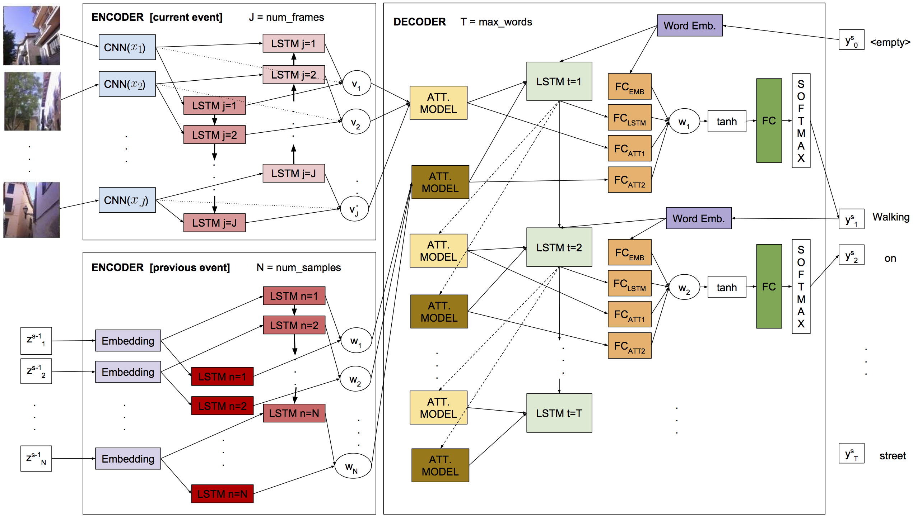

# Egocentric Video Description based on Temporally-Linked Sequences 

This repository contains the code for building the Temporally-linked Multi-input Attention (TMA) model, which was presented in
the work [Egocentric Video Description based on Temporally-Linked Sequences](), 
submitted to the [Journal of Visual Communication and Image Representation](https://www.journals.elsevier.com/journal-of-visual-communication-and-image-representation). 
With this module, you can replicate our experiments and easily deploy new models. TMA is built upon our fork of 
[Keras](https://github.com/MarcBS/keras) framework ([version 1.2](https://github.com/MarcBS/keras/tree/Keras-1.2-(stable))) and tested for the [Theano](http://deeplearning.net/software/theano)
backend.

## Features: 

 * Temporally-linked mechanism for learning using information from previous events.
 * Multi-input Attention LSTM model over any of the input multimodal sequences.
 * Peeked decoder LSTM: The previously generated word is an input of the current LSTM timestep
 * MLPs for initializing the LSTM hidden and memory state
 * Beam search decoding

## Architecture



## Requirements

TMA requires the following libraries:

 - [Our version of Keras](https://github.com/MarcBS/keras) >= 1.2.3
 - [Multimodal Keras Wrapper](https://github.com/MarcBS/multimodal_keras_wrapper) >= 0.7
 - [Coco-caption evaluation package](https://github.com/lvapeab/coco-caption/tree/master/pycocoevalcap/)

## Instructions:

Assuming you have a dataset and features extracted from the video frames:

0) Set the paths to Keras and Multimodal Keras Wraper in train.sh
 
 1) Prepare data:
 
   ``
 python data_engine/subsample_frames_features.py
 ``
 
  ``
 python data_engine/generate_features_lists.py
 ``
 
  ``
 python data_engine/generate_descriptions_lists.py
 ``

See [data_engine/README.md](data_engine/README.md) for detailed information.

2) Prepare the inputs/outputs of your model in `data_engine/prepare_data.py`
  
3) Set a model configuration in  `config.py` 
 
4) Train!:

  ``
 python main.py
 ``

## Dataset

The dataset [EDUB-SegDesc](http://www.ub.edu/cvub/edub-segdesc/) was used to evaluate this model. It was acquired by the wearable camera Narrative Clip, taking a picture every 30 seconds (2 fpm). It consists of 55 days acquired by 9 people. Containing a total of 48,717 images, divided in 1,339 events (or image sequences) and 3,991 captions.

## Citation

If you use this code for any purpose, please, do not forget to cite the following paper:

```
Marc Bolaños, Álvaro Peris, Francisco Casacuberta, Sergi Soler and Petia Radeva.
Egocentric Video Description based on Temporally-Linked Sequences
In Special Issue on Egocentric Vision and Lifelogging Tools. 
Journal of Visual Communication and Image Representation (VCIR), (SUBMITTED).
```

## About

Joint collaboration between the [Computer Vision at the University of Barcelona (CVUB)](http://www.ub.edu/cvub/) group at [Universitat de Barcelona](www.ub.edu)-[CVC](http://www.cvc.uab.es) and the [PRHLT Research Center](https://www.prhlt.upv.es) at [Universitat Politècnica de València](https://www.upv.es).


## Contact

Marc Bolaños ([web page](http://www.ub.edu/cvub/marcbolanos/)): marc.bolanos@ub.edu

Álvaro Peris ([web page](http://lvapeab.github.io/)): lvapeab@prhlt.upv.es 
